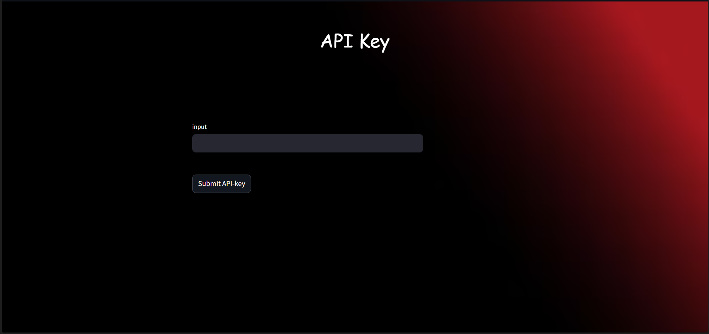
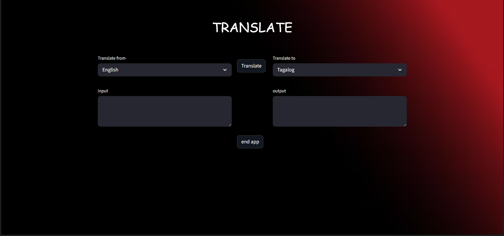

# Describtion
A simple, lightweight web app for instant text translation. It uses `Deep Translate’s API` under the hood to provide fast and accurate translations across 59 languages.
The app features a clean, user‑friendly interface where you can paste or type text, choose source and target languages, and get results in real time.

## Usage
* click on this link for using it as a web-app: 
https://mariob2006-translate-srcmain-ea102j.streamlit.app/

## Libraries used
* requests
* streamlit
* json

## How to use
When first click on the link above, it will show a window where the user has to provide an API-key. The key can be found under: 
https://rapidapi.com/gatzuma/api/deep-translate1/playground/apiendpoint_c1e24071-807e-4926-b2ec-1122ffdef37e 
The user has to subscribe to the service first (basic plan is free and recommended for casual usage only)
When entered the key and clicking on "submit API-key", 
 
the main app will open. Here, the user can choose the languages. The text needs to be translated is written inside the "input" text field. After clicking on "Translate", the result will be shown in the "output" text field. In case of providing a wrong API-key, there will be displayed an error message, saying that the website must be reloaded and re-submitting the right key.  
**It is important to click on "end app" to successfully close the app which also removes the API-key used.** 

## Roadmap
* v1: first version of the web-app
* v2: adding more languages for translation, adding auto-detection